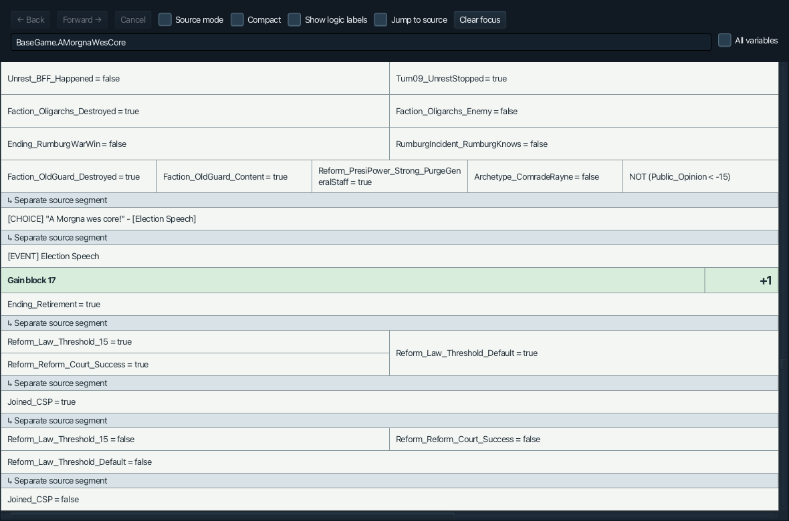
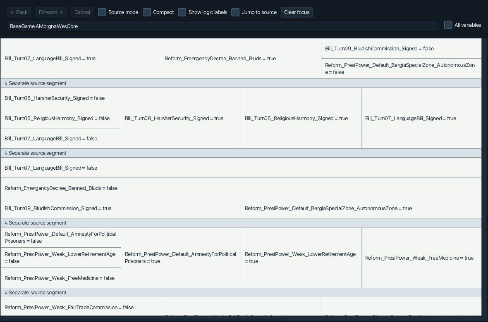
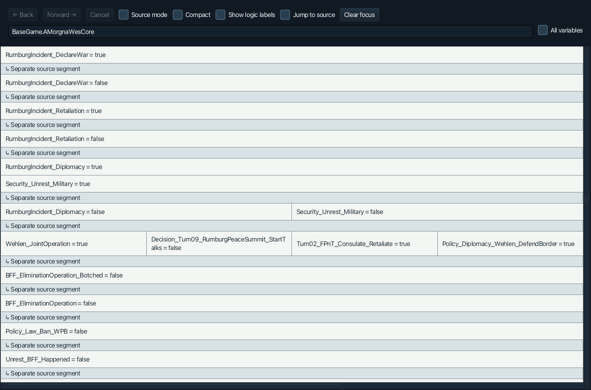
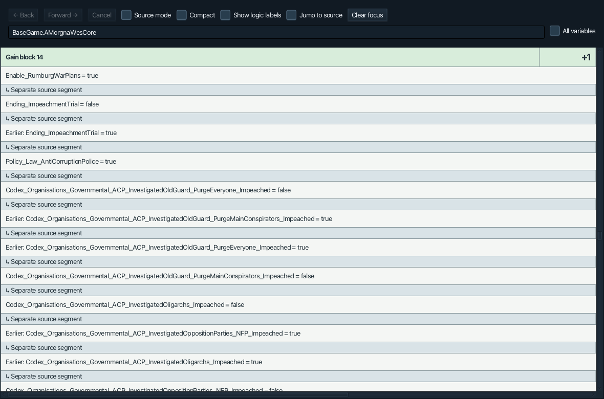
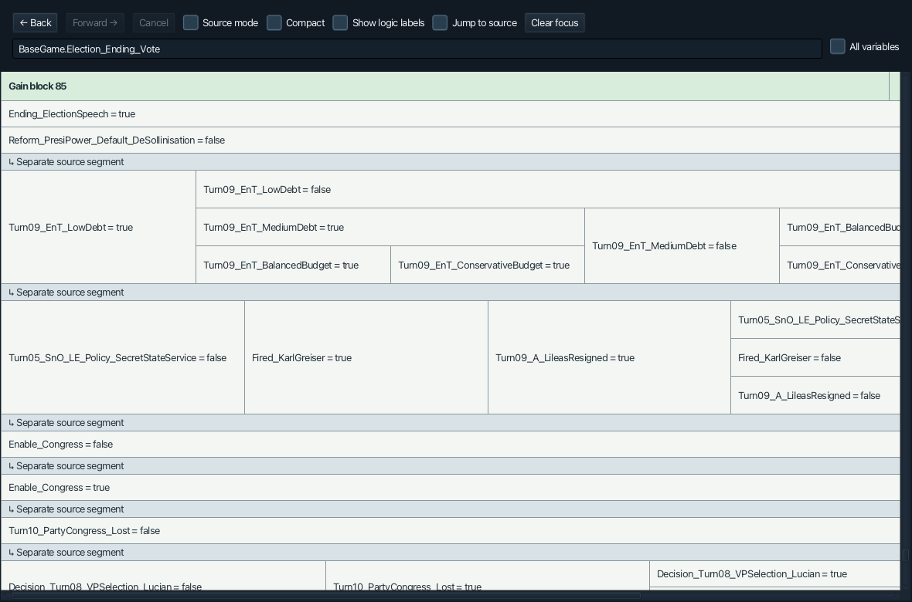
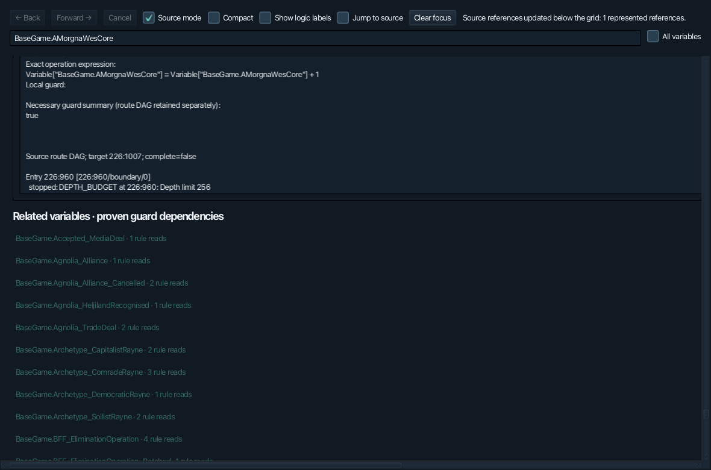

# Route-model correction report

Continued from the current corrected project (`SordlandTreeViewer-corrected.zip`). All 166 data files remain byte-identical. The fixed toolbar, popup picker, quantitative default catalogue, cached mode toggle, and spreadsheet-only default view are preserved.

## Root cause and exact video match

`NumericRouteResolver.coalesce()` replaced distinct control-flow branches with one synthetic OR expression. Unsupported boundaries became Boolean `unknown` leaves. The renderer then invented route numbers from expression sections and multiplied the resulting column count by 180 pixels, producing the large blank rectangles shown in the recording.

The recording is **BaseGame.AMorgnaWesCore**, identified from the actual data and its visible condition/block fingerprints:

| Video area | Exact write | Corrected geometry |
|---|---|---|
| UnrestStopped and Language Bill conditions; huge white alternatives | Gain block 16, Conversation 244 / Dialogue 1082 | At most 6 columns and 4 logical rows per band |
| Long artificial route list; Rumburg/Wehlen/BFF conditions | Gain block 11, Conversation 226 / Dialogue 1007 | At most 6 columns and 6 logical rows per band |
| Visible Gain block 14; impeachment/VP conditions | Conversation 240 / Dialogue 201 | Single-column source segments |

The old full expressions had 46, 131, and 10 columns respectively. The corrected bands are derived directly from source topology; their labels are source-entry identities, not expression-section numbers.

## New design

`RouteProof.Graph` stores memoized source nodes and ordered arcs, exact entry identities, predicates, writes, source choices, and typed boundary metadata. Shared predecessors remain shared. Complete root-to-write walks are **not enumerated**. A 24-diamond regression retains 73 nodes rather than expanding 2²⁴ walks.

The table renders contiguous source segments between actual forks/merges. Independent branches stack vertically; logical OR inside a segment remains horizontal. Shared nodes are retained once, and small equivalent sibling segments at the same source fork/merge can share factored cells while retaining every reference. Factoring never crosses write blocks. Condition-free segments are compacted with all their references retained.

A partial boundary is metadata, never a condition. Known predicates remain visible; warnings are compact, with exact reasons and retained source edges in Source mode. Historical predicates remain distinct from current-state predicates. A conservative necessary-condition summary supports compatibility checks; it is not used to reconstruct the graph.

Independent writes remain separate. Stable reference identities also remove recursive hashing of entire proofs. In the desktop acceptance run, the full AMorgna inspector loaded in approximately **1.1 seconds**, and all **89 Election_Ending_Vote blocks** in **3.6 seconds**. These are measurements on this machine, not performance guarantees.

## Genuine remaining boundaries

- Conversation **226 / 960** reaches the retained depth limit of 256 while proving the write at 226 / 1007. Only that frontier is partial; known downstream conditions remain.
- Conversation **244 / 7 and 244 / 8** reference `GameCondition.Turn11_SnO_RumburgWarWin`, outside the existing supported predicate grammar. Their exact predicates remain in source evidence.
- Unsupported/control commands, malformed source constructs, connector/cross-conversation links, cycles, missing entries, and node/depth budgets remain explicit boundary types. No conditions or links are invented.

Across AMorgna's 20 writes, 10 retain some partial ancestry. Across the election variable's 89 writes, 88 retain a command or predicate boundary. This does **not** replace their known branches with unknown cells: the retained known graph remains rendered and inspectable.

## Classes changed

Added `RouteProof`. Updated `NumericRouteResolver`, `DialogueGuardResolver`, `NumericVariableLayout`, `CompatibilityAnalyzer`, `VariableAnalyzer`, `NumericVariableGrid`, and the Source-mode description in `VariableAnalysisView`. The picker, inspector shell implementation, main viewer, and graph canvas are unchanged.

Added `RouteDagChecks`, `RouteDagVisualChecks`, and `scripts/test-route-ui.sh`. Existing tests were retained and updated where the old expected representation treated partial metadata as a logical cell.

## Validation

- **12,374,780 headless checks passed**, including all existing tests and the new DAG/geometry regressions (15.69 seconds).
- All five desktop suites passed: inspector shell, variable picker/Boolean family, numeric compatibility/source references, runtime Budget canvas, and the new exact-video/full-election acceptance suite.
- New assertions cover diamonds, more than twelve alternatives, shared-node growth, graph truth, complete/partial siblings, source-backed labels, duplicate/independent writes, factored provenance, absence of unknown cells, bounded real geometry, and all 89 election blocks with independent +1/+2/+3 writes.
- Existing Economy Conversation 93 writes 275/285 and Highway/OnTime requirements remain verified.

Run `./scripts/test.sh` and the five `scripts/test-*-ui.sh` scripts with Liberica JDK 25 FULL. Desktop tests need a display. Logs, source-match diagnostics and screenshots are included in `docs/route-validation/`.

## Screenshots from the same real-data areas

